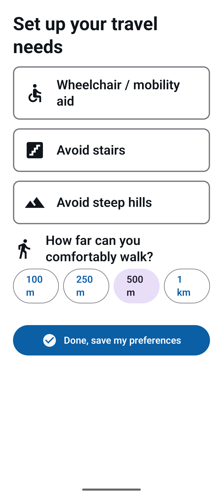

# TransitLens

**On-device multimodal ML assistant that turns complex urban transit into audio
and haptic guidance for people with visual, cognitive, and language barriers.**

Kotlin · Jetpack Compose · CameraX · TensorFlow Lite · ML Kit · GTFS-RT ·
Android Accessibility Services · Android 10+ (API 29+)

---

## Problem

Over 2.2 billion people globally have a vision impairment, and organizations
like Seattle's Hopelink serve thousands of people with disabilities who rely on
transit they find too complex to navigate independently. Existing transit apps
assume literacy (route numbers, stop names, map labels), ignore physical
constraints (they will route a wheelchair user up a hill or through a station
with no elevator), give no grounding in what the user is *currently looking at*,
demand screen attention while navigating a physical space, and overload users
with simultaneous voice, map, and countdown output.

TransitLens is a camera-first, text-free, haptic-guided interface backed by
on-device ML that needs no internet connection for core functionality.

## Architecture

```
[Camera — CameraX]
      │
      ▼
[Scene Understanding — on device]
  ├─ Scene Classifier (TFLite MobileNetV3-Small): bus_stop / train_platform /
  │   street_corner / vehicle_interior / transfer_hub / unknown
  ├─ Object Detector (TFLite): bus, train, elevator_door, escalator, crosswalk,
  │   wheelchair_ramp, tactile_paving, accessibility_sign
  └─ Text Recognition (ML Kit): route numbers, stop ids, arrival times, symbols
      │
      ▼
[Context Fusion Engine]  scene + objects + text + nav state + constraints
      │                  → ActionContext → GuidanceAction
      ▼
[Accessibility-Aware Router]  constraint-weighted Dijkstra over GTFS + OSM
      │                       → NavigationPlan (steps, landmarks, compliance)
      ▼
[Guidance]  Haptic vocabulary + Audio (TTS + landmarks) + minimal AR overlay
      │
      ▼
[GTFS-RT]  live arrivals (OneBusAway), offline fallback to cached static GTFS
```

See [`docs/`](docs/) for the architecture decisions behind each layer.

## Project status

Built in phases; each phase ends at something that compiles and is verified
(`./gradlew :core:test :app:testDebugUnitTest :app:assembleDebug`).

| Phase | Scope | Status |
|---|---|---|
| 0 | Pure-Kotlin `:core`: router, fusion, haptics, GTFS parse, text extract, graph builder | ✅ 38 unit tests green |
| 1 | Android `:app`: Compose, Hilt, DataStore, zero-text onboarding, haptics + TTS | ✅ `assembleDebug` green |
| 2 | ML training (Python): MobileNetV3 classifier + YOLOv8n detector → TFLite | ✅ pipeline exercised end-to-end¹ |
| 3 | On-device pipeline in `:app`: CameraX + TFLite + ML Kit + fusion + live guidance | ✅ builds + packages models |
| 4 | Transit data: Room cache, GTFS import, GTFS-RT protobuf parser, real-stops graph | ✅ parser + graph unit-tested |
| 5 | Extra screens, AR overlay, full on-device demo | 🔧 in progress |

¹ The training pipeline is validated end-to-end on a **synthetic smoke dataset**
(train → evaluate → TFLite export → interpreter verify). Production accuracy
(ADR-002 targets) needs the real datasets — see [`ml_training/README.md`](ml_training/README.md).
Models are bundled into `assets/models/` (gitignored); the app degrades gracefully if absent.

## Screenshots

Running on an Android 15 emulator (Pixel 6, API 35):

| Zero-text onboarding | Ready to navigate |
|---|---|
|  |  |

The live navigation screen runs the full on-device pipeline (scene classifier +
object detector + ML Kit OCR → context fusion → haptic/audio guidance) over the
CameraX feed, announcing the current cue via a TalkBack live region.

## Haptic language

A single-motor phone cannot render spatial left/right, so directions are
distinguished by rhythm. Every pattern has an audio equivalent (see
[ADR-003](docs/ADR-003-haptic-first.md)); patterns live in `HapticPattern` and
are integrity-checked by tests.

| Pattern | Rhythm | Meaning |
|---|---|---|
| TURN_LEFT | short-short-long | turn left ahead |
| TURN_RIGHT | long-short-short | turn right ahead |
| CONTINUE | single medium pulse | keep going straight |
| BOARD_NOW | three rapid pulses | vehicle arriving, board now |
| ALIGHT_NOW | two long pulses | your stop, get off |
| WAIT | slow repeating pulse | stand by |
| ARRIVED | long-short-long | you have arrived |
| CROSSING_SAFE | four rapid pulses | crossing cue |
| ELEVATOR_AHEAD | double-pulse ×3 | elevator detected |
| ALERT | irregular urgent | attention needed |
| RECALCULATING | gentle single pulse | route updating |

## Accessibility compliance (target: WCAG 2.1 AA)

- TalkBack: content descriptions on all elements; custom viewfinder semantics;
  actions announced before execution.
- Large text: `sp` units throughout; scales with system font size.
- Touch targets ≥ 48×48 dp.
- Contrast ≥ 4.5:1; meaning never conveyed by color alone.
- Respects system Reduce Motion; AR animations disabled when set.
- Switch access reachable; no time-limited interactions.
- Every haptic has an audio equivalent; audio-only mode available.

## Quick start

**`:core` (works today, no Android SDK needed):**

```bash
./gradlew :core:test      # runs the domain-logic test suite
```

**`:app` (from Phase 1):** requires the Android SDK. Open in Android Studio, or
install the command-line SDK tools and run `./gradlew :app:assembleDebug`, then
deploy to a device or emulator.

## Architecture decisions

- [ADR-001 — On-device ML over cloud](docs/ADR-001-on-device-ml.md)
- [ADR-002 — MobileNetV3-Small](docs/ADR-002-mobilenetv3-small.md)
- [ADR-003 — Haptic-first guidance](docs/ADR-003-haptic-first.md)
- [ADR-004 — GTFS standard](docs/ADR-004-gtfs-standard.md)
- [ADR-005 — Constraint-weighted Dijkstra](docs/ADR-005-modified-dijkstra.md)
- [ADR-006 — Elevator safety threshold](docs/ADR-006-elevator-safety-threshold.md)
- [ADR-007 — Jetpack Compose](docs/ADR-007-jetpack-compose.md)
- [ADR-008 — `:core` / `:app` module split](docs/ADR-008-core-app-module-split.md)
- [ADR-009 — Object-detector training toolchain](docs/ADR-009-object-detector-training.md)

## Acknowledgements

Hopelink and King County Metro open data; OpenStreetMap contributors.

---

*Built by Vatsal Patel · github.com/vatsalp2008/TransitLens*
